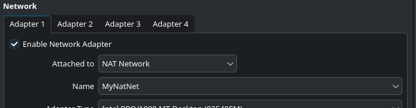

<div align="center">

# Project: Cyber Security Lab Environment Setup

**Building and setting up an isolated virtual lab environment for penetration testing and ethical hacking practices.**
</div>

<p align="center">
	
	
	
	
	
	
	
	
	
	
	
	
</p>

---

## Project Overview

In this project, I had to setup a **virtual environment** that would be used as **cybersecurity and penetration testing laboratory** using VirtualBox and Kali Linux.

The main purpose of this lab was to be able to create a controlled environment or learn how to create a controlled environment where I'll be able to test, use, and learn cybersecurity tools, network scanning, reconnaissance, vulnerability assessment, and other security-testing activities. It also to have an environment as a safe space for the use of these tools and techniques.

This lab is configured on a private virtual network, so that additional machines can be added later and used as targets for authorized security testing.

---

## Objectives of this Project

The main objectives of this project are listed below;

1. Installation and configuration of VirtualBox.
2. Downloading and importing Kali Linux as a virtual machine in VirtualBox.
3. Creating a private *Nat Network* for the cybersecurity lab.
4. Configuring network connectivity for Kali Linux.
5. Assigning a consistent IP address to the Kali Linux VM.
6. Verify network connectivity and DNS resolution.
7. Take a clean VM snapshot for recovery.
8. Document the complete setup process.
9. Prepare the environment for the future cybersecurity projects.

---

## Purpose of the Lab

This lab will provide us with a safe space and a controlled environment for cybersecurity learning and authorized security testing.

It can be used for activities like;

- Network reconnaissance
- Port scanning
- Vulnerability assessment
- Packet analysis
- Web security testing
- Exploitation practices
- Security-tool experimentation

## Architecture of the Lab


---

## Lab Configuration

| Components      | Configuration              |
| ----------      | -------------              |
| Host OS         | Debian Linux               |
| Host RAM        | 8GB                        |
| Processor       | Intel Core i5 2nd Gen      |
| Hypervisor      | VirtualBox 7.2             |
| Security OS     | Kali Linux                 |
| Kali RAM        | 2048MB                     |
| Virual Network  | NAT Network                |
| Network Address | 10.30.30.0/24              |
| Kali IP Address | 10.30.30.50/24             |
| Default Gateway | 10.30.30.1                 |
| DNS Server      | 8.8.8.8                    |
| Future VM Range | 10.30.30.4 -> 10.30.30.254 |

---

# Lab Setup Procedure

## 1st Step -> Installing 7-Zip

7-Zip was installed to extract the Kali Linux virtual-machine package (although I didn't needed but it was one of the requirements for the project so I completed it), which may be distributed as a `.7z` archive.

And since I'm using *Debian Linux* so the command that I used to install it is the following;

```
sudo apt install p7zip-full
```

**Tool:** 7-Zip

---

## 2nd Step -> Install VirtualBox

I installed VirtualBox as the hypervisor.

---

I created a NAT network that was created in VirtualBox.

Configuration:
NetworkName: NatNetwork
IPv4 Prefix: 10.30.30.0/24
DHCP:        Enabled
IPv6:        Disabled


